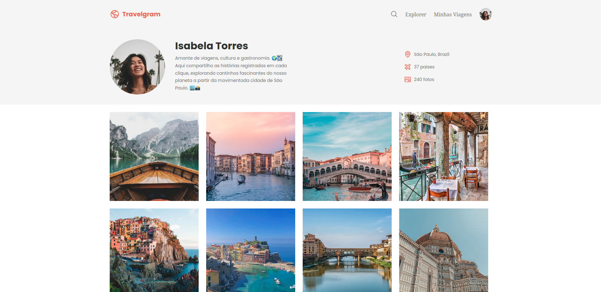

# ✈️ Projeto: Página de Perfil de Viagens

Este repositório contém um projeto prático desenvolvido durante o módulo intermediário do curso de **Desenvolvimento Fullstack**. O objetivo principal foi consolidar conhecimentos de HTML e CSS, introduzindo o uso de **Flexbox** para layouts responsivos e modernos.

---

## 🚀 O que foi desenvolvido
Neste projeto, apliquei os conceitos iniciais de Front-end mais o adicional do flexbox para construir uma interface de galeria estruturada e estilizada, focando na legibilidade e disposição dos elementos.

### 🧠 Conceitos Praticados:
* **Estrutura Básica:** Organização semântica.
* **Organização:** Uso do flex box para o layout.
* **Cores e Fontes:** Utilização de variáveis para uma melhor padronização e personalização visual.
* **Alinhamento e Tamanho:** Controle de dimensões e posicionamento de elementos na tela.

---

## 🛠️ Tecnologias Utilizadas
* **HTML5** (Estruturação)
* **CSS3** (Estilização)

---

## 📸 Visualização do Projeto


#### 🔗 **[Clique aqui para acessar o site funcionando online! (versão desktop)](https://menezes-mr.github.io/perfil-viagens/)**
---

## 🏁 Como testar o projeto
Se quiser rodar o código na sua máquina, siga os passos abaixo:
1. Faça o clone do repositório:
   ```bash
   git clone https://github.com/menezes-mr/perfil-viagens.git
   ```
2. Entre na pasta do projeto:
   ```bash
   cd perfil-viagens
   ```
3. Dê um duplo clique no arquivo `index.html` para abri-lo no seu navegador de preferência.

---
⭐ *Repositório criado para documentar minha evolução e estudos no desenvolvimento web!*
